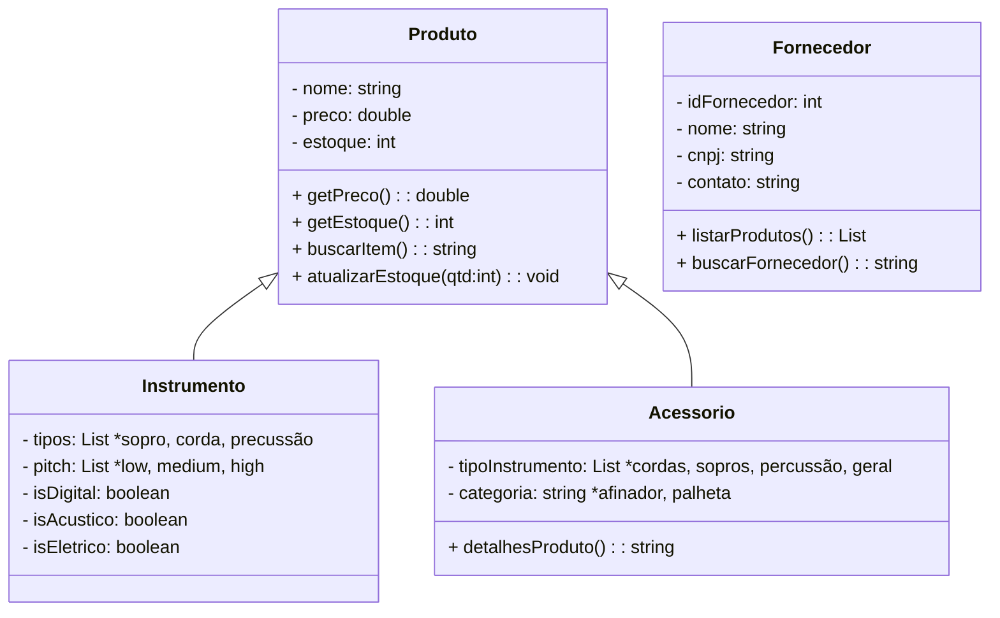

```mermaid
classDiagram
  class Produto {
    - nome: string
    - preco: double
    - estoque: int
    + getPreco(): double
    + getEstoque(): int
    + buscarItem(): string
    + atualizarEstoque(qtd:int): void
  }

  class Instrumento {
    - tipos: List<string>  *sopro, corda, precussão
    - pitch: List<string>  *low, medium, high
    - isDigital: boolean
    - isAcustico: boolean
    - isEletrico: boolean
  }

  class Acessorio {
    - tipoInstrumento: List<string>   *cordas, sopros, percussão, geral
    - categoria: string               *afinador, palheta
    + detalhesProduto(): string
  }
class Fornecedor {
    - idFornecedor: int
    - nome: string
    - cnpj: string
    - contato: string
    + listarProdutos(): List<Produto>
    + buscarFornecedor(): string
  }

Produto <|-- Instrumento
Produto <|-- Acessorio
```

*https://github.com/marcosfrancisco/aulapoo/blob/main/aulaclasses.md*
